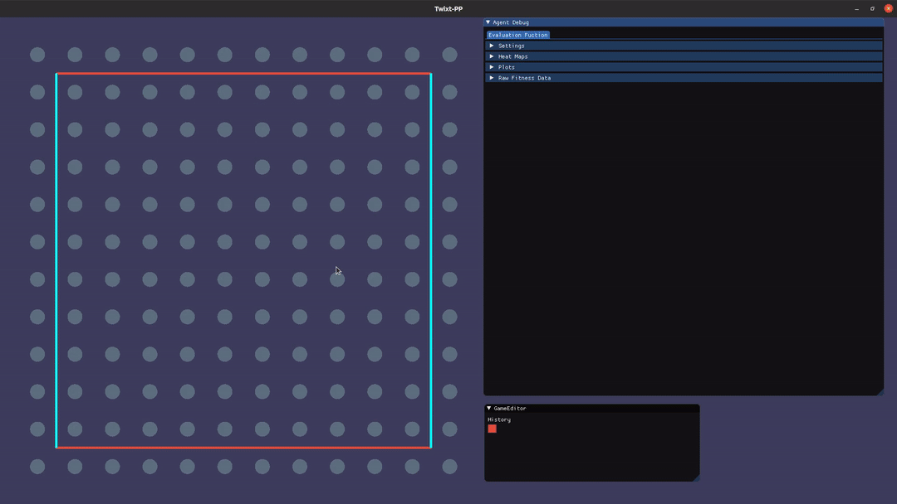

# Bot Evaluation Framework for Twixt-PP 

Following is a bot performance visualisation framework, applied for TwixtT-PP board game. The main idea behind the project is to present evaluation steps made by the game-playing agent with ability of real-time interaction. 

### Bot Components

Game-playing agent consists of following components 

- Negamax with AlfaBeta prunning
- Zobrist Hashing
- Transposition Table
- Move Ordering component

### TwixT-PP

TwixT-PP is "Paper and Pencil" variant of [TwixT](https://en.wikipedia.org/wiki/TwixT) board game. 

### Dependencies

Project uses [imgui-sfml](https://github.com/SFML/imgui-sfml) as GUI component. 